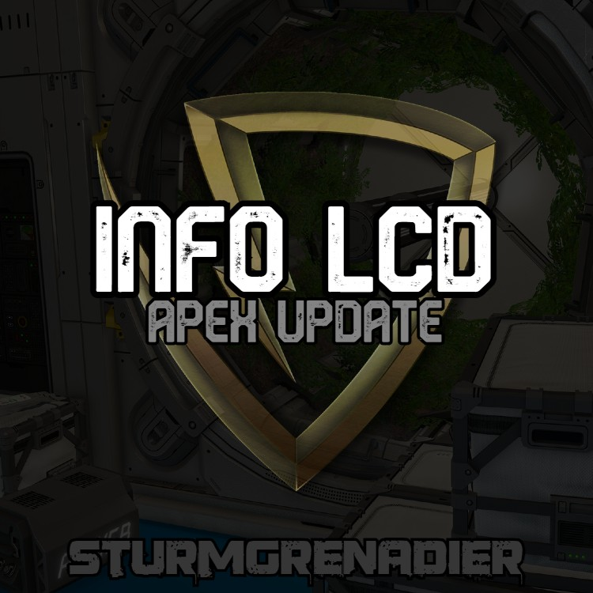

  

  
  
  
  

> **"I want to know what my ship is doing without leaving cockpit view."**

**Chris's flagship SE mod.** Text-surface scripts + config that render live ship and base data on **Apex LCD blocks** — no server code, no dependencies, no world corruption if you remove it. Currently sitting on **1,335+ Steam Workshop subscribers**.

  

## ✨ What it shows

| Category | What lands on the LCD |
|---|---|
| **Cargo** | Total cargo mass, per-container breakdown, sorted by mass |
| **Power** | Reactor + battery output, consumption, minutes-remaining projection |
| **Jump drive** | Charge %, ETA to full, per-drive status on ships with multiple |
| **Ammo** | Ammo counts per weapon type across the whole grid |
| **Airlock** | Pressurization state per airlock, warning colors on active vent |
| **Detailed info** | Anything the block's DetailedInfo exposes — automatically formatted |
| **Custom layouts** | Position-based screen layout scales to any LCD size, not hardcoded |

## 🚀 Install

**Via Steam Workshop (recommended):**
1. [Subscribe on the Workshop page](https://steamcommunity.com/sharedfiles/filedetails/?id=3580736330)
2. Enable the mod when creating or loading a world
3. Place an Apex LCD block, open its terminal, and select an `InfoLCD - <thing>` script

**No world-side setup required.** Client-side only — you can add it to any existing world.

## 🎯 Compatibility

- ✅ **Space Engineers 1** — actively maintained
- ✅ **Multiplayer** — works on dedicated servers because it does nothing server-side
- ✅ **Existing saves** — safe to add or remove; scripts fall back to blank if disabled
- ✅ **Other LCD mods** — coexists (only touches Apex LCD blocks specifically)
- ⚠️ **Non-Apex LCD blocks** — not supported by design (see the [Apex Advanced sibling](https://github.com/gitpush-mod/se-infolcd-apex-advanced) for broader LCD coverage)

## 🧑‍🤝‍🧑 Sibling mod

A more feature-rich variant with expanded readouts lives at [**se-infolcd-apex-advanced**](https://github.com/gitpush-mod/se-infolcd-apex-advanced). Both are maintained in parallel; shared features stay in sync.

## 🐛 Found a bug?

Two options, both fast:

- **[Open an issue with the bug report template](https://github.com/gitpush-mod/se-infolcd-apex-update/issues/new?template=bug_report.md&labels=bug)** — best for reproducible bugs, gets tracked and fixed
- **Leave a Steam Workshop comment** — better for quick "hey does this work with X?" questions

## 🙌 Credits

- **Author:** [Chris Carpenter (Godimas101)](https://github.com/Godimas101)
- **Built with:** the Space Engineers modding SDK + a lot of iteration on real ships
- **Sturmgrenadier Hosting** — [sghq.org](https://sghq.org/), the SE server community that stress-tests this mod

## 🧡 Support

InfoLCD is free and always will be. If it saves you time on your next build, consider supporting on **Patreon** — it's more a running project log than a tip jar. Behind-the-scenes updates, in-progress mod work, and dev notes across everything under [`gitpush-mod`](https://github.com/gitpush-mod) and [The Canadian Space](https://thecanadian.space).

---

*Part of the [`gitpush-mod`](https://github.com/gitpush-mod) mod collection. Made with ♥ (and a lot of coffee) by Godimas + Claude.*
